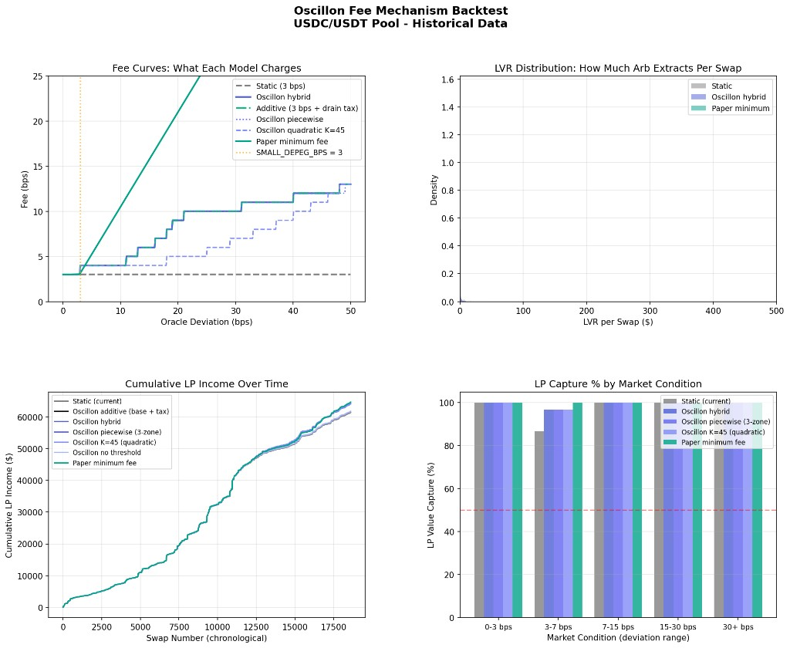
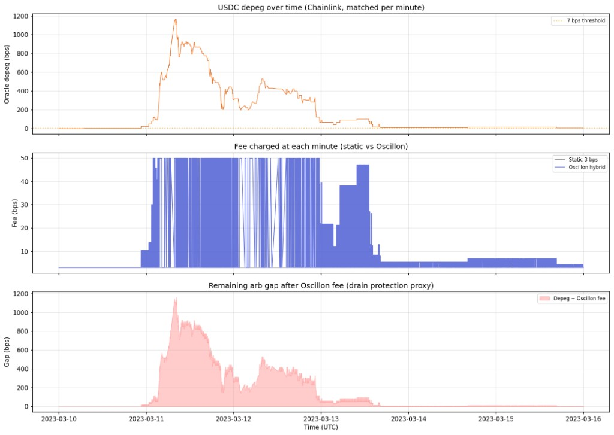
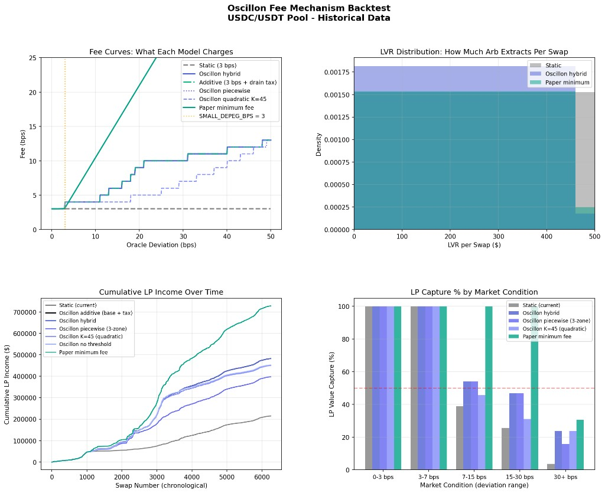

# Oscillon Hook

**Inventory-risk protection for Uniswap v4 stable pools.**

Oscillon is a dynamic-fee hook that monitors oracle prices on the token being sold, detects depeg conditions, and applies a **base fee plus depeg surcharge** so liquidity providers are compensated when traders drain below-peg stablecoins.

Designed for stable/stable pools such as USDC/USDT, USDC/DAI, and USDT/DAI.

---

## Why Oscillon Exists

Static swap fees (e.g. 3 bps flat) do not scale with depeg risk. When a stablecoin trades below $1, arbitrageurs can extract value from the pool while LPs absorb impaired inventory. Oscillon raises fees on **drain swaps** (selling the below-peg asset) while keeping normal swaps competitive at peg.

---

## How It Works

```
Swap (user sells tokenIn)
        │
        ▼
┌───────────────────────────────────────┐
│  OscillonHook.beforeSwap              │
│  1. Identify input token (token0/1)   │
│  2. Read Chainlink + pool TWAP        │
│  3. Compute depegBps + isDrain        │
│  4. Select fee = base + surcharge     │
│  5. Emit DepegDetected                │
└───────────────────────────────────────┘
        │
        ▼
   Uniswap v4 applies override fee
```

| Component | Role |
|-----------|------|
| `ChainlinkOracleAdapter` | Primary USD price per token |
| `OscillonTwapOracle` | 30-minute pool TWAP fallback |
| `OscillonPriceEngine` | Blends sources; disagreement guard at 20 bps |
| `OscillonFeePolicy` | Hybrid piecewise + quadratic surcharge curve |
| `OscillonHook` | Orchestrates policy and returns dynamic fee |

**Drain swap** = user sells the token that is below $1 (`pegBelow = true`).  
**Restore swap** = user sells the above-peg token → base fee only.

---

## Fee Model

Oscillon uses **base fee + depeg surcharge** (not a replacement curve):

```
total fee = BASE_FEE (3 bps) + depeg surcharge (hybrid curve)
```

| Scenario | Fee (approx.) |
|----------|----------------|
| At peg, any direction | **3 bps** base |
| 6 bps drain (sell below-peg USDT) | **4 bps** (3 + 1) |
| 20 bps drain | **9 bps** (3 + 6) |
| Restore direction (sell above-peg) | **3 bps** base |
| Max cap | **50 bps** |

Constants (`OscillonConstants.sol`):

- `BASE_FEE_PIPS = 300` (3 bps)
- `SMALL_DEPEG_BPS = 3` — dynamic path starts here
- `MAX_FEE_PIPS = 5000` (50 bps)
- `MAX_ORACLE_AGE = 1 hour` (aligned with intraday depeg / fee-curve horizon)
- `ORACLE_DISAGREE_BPS = 20` — Chainlink vs TWAP blend threshold

On each swap the hook emits:

```solidity
event DepegDetected(
    PoolId indexed poolId,
    uint256 depegBps,
    uint24 feeApplied,
    uint256 swapSize,
    bool isDrain,
    bool usingFallback,
    bool twapWarmedUp
);
```

`twapWarmedUp` is reporting-only — it does not change `feeApplied`. It's `false` whenever the TWAP ring buffer hasn't spanned the full 30-minute `TWAP_WINDOW` yet (freshly registered pools, or any read before enough history has accumulated), meaning any TWAP-sourced price in this swap was raw spot, not a real windowed average. See [Known Limitations](#known-limitations) and `THREAT_MODEL.md` §1.2.

---

## Backtest Results

Historical simulations on USDC/USDT swap data compare Oscillon against a static 3 bps fee. Two periods are shown: a calm month (May 2026) and the USDC depeg crisis (March 2023).

### May 2026 — normal market conditions

~18,500 chronological swaps with low volatility. Oscillon keeps fees near the 3 bps base while static and dynamic models earn similar total income (~$65k). The benefit shows up in the **3–7 bps deviation** bucket, where static LP capture drops to ~85% and Oscillon stays near 100%.



### March 2023 — USDC depeg crisis

#### Minute-by-minute fee response

Chainlink-matched replay from March 10–16, 2023. As USDC depegged to ~1,200 bps, Oscillon scaled fees from 3 bps to the 50 bps cap while static stayed flat.



*Top: oracle depeg magnitude. Middle: static 3 bps vs Oscillon hybrid. Bottom: remaining arb gap after fee (drain protection proxy).*

#### Full-period dashboard (~6,200 swaps)

Fee curves, LVR distribution, cumulative LP income, and LP capture % over the March 2023 stress window. Income spikes around swap 2,500–3,500 when the depeg hit. Oscillon hybrid ends ~2× static (~$450k vs ~$215k) and holds 25–50% LP capture in the 15–30+ bps ranges where static collapses below 10%.



#### Model comparison (same period)

Side-by-side fee models including hybrid, piecewise, quadratic (K=45), and additive (base + drain tax). Additive and paper-minimum benchmarks show the upper bound on LP protection.


> Backtests are illustrative simulations on historical data. On-chain behavior depends on oracle freshness, pool liquidity, and swap direction. See [Known Limitations](#known-limitations).

---

## Architecture

```
src/
├── OscillonHook.sol              # beforeSwap fee override + pool registry
├── oracle/
│   ├── OscillonPriceEngine.sol   # Chainlink + TWAP cascade
│   └── adapters/
│       └── ChainlinkOracleAdapter.sol
├── libraries/
│   ├── OscillonFeePolicy.sol     # Hybrid surcharge curve
│   ├── OscillonDepegMath.sol     # Depeg bps + disagreement guard
│   └── OscillonTwapOracle.sol    # In-pool TWAP ring buffer
└── constants/
    └── OscillonConstants.sol
```

**Multi-pool support:** owner calls `registerPool()` per stable pair with Chainlink adapters for each token. No pool freeze — severe depeg caps fee at 50 bps; swaps continue.

---

## Quick Start

### Build & test

```bash
forge build
forge test --match-contract OscillonHook -vv
```

### Deploy (Anvil local)

```bash
# Terminal 1
anvil --chain-id 31337

# Terminal 2
source .env   # PRIVATE_KEY must have 0x prefix
forge script script/DeployOscillon.s.sol:DeployOscillon \
  --rpc-url http://127.0.0.1:8545 \
  --broadcast
```

Deployment addresses are written to `oscillon-ui/src/deployment.json`.

### Deploy (Arbitrum Sepolia)

```bash
forge script script/DeployOscillon.s.sol:DeployOscillon \
  --rpc-url "$RPC_URL" \
  --broadcast
```

---

## Frontend Integration

The UI should show **three linked values** per swap:

1. **Hook price** — effective USD price for the input token (Chainlink + TWAP logic)
2. **Depeg deviation** — bps from $1 for that token
3. **Total fee** — base (3 bps) + surcharge, from `DepegDetected` or swap simulation

Use `getDeployment(chainId)` from `oscillon-ui/src/deployment.config.ts`.  
Fee quotes must be **per swap direction** — use `depegBps0` / `depegBps1` from `getPoolState()` for the correct token.

---

## Security

- Hook callbacks restricted to `PoolManager` via `BaseHook`
- Chainlink staleness: `block.timestamp > updatedAt + 1h` → TWAP fallback
- Oracle disagreement > 20 bps → conservative price (closer to $1)
- Exact-output swaps disabled when `depegBps >= 3`
- Rolling drain multiplier increases fee under sustained drain pressure

Liquidity add/remove is unrestricted (no hook on LP operations).

---

## Known Limitations

**Surplus accounting (indicative only)**  
`surplusAccrued` and `protocolAccrued` track theoretical surplus from dynamic fees but are not connected to actual v4 fee settlement. `collectProtocolFees` requires proper fee skimming via `donate()` or `afterSwapReturnDelta` for production.

**Oracle latency**  
TWAP window is 30 minutes. During fast depegs, TWAP can lag spot. Chainlink freshness uses a 1-hour `maxAge` (then TWAP fallback).

**K parameter**  
`K_STANDARD = 45` used universally; thin-pool tier not yet wired to live liquidity reads.

**POC scope**  
Static thresholds; single oracle per token; economic calibration from backtests, not live mainnet stress.

---

## License

MIT
